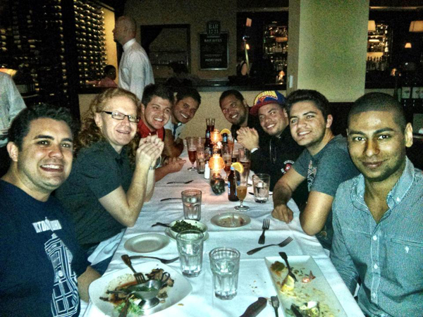

 
I went to the HTML5 Developers Conference in San Francisco (01 Apr 13 to 03 Apr 13) and there I met some awesome developers from Brazil and as they are very active to help the developers community in Brazil with speaks, presentations and events they decided record a chat with me talking about how it is work in US, how I got a job here and some good tips for those that want to try this adventure.

The awesome developers from Brazil including myself and the Principal Mozilla's Evangelist Christian Heilmann, we had a great dinner. ;)

## The chat

The video isn't in a good quality but the content is the important.

<iframe src="https://www.youtube.com/embed/73RVbGcZQXk" frameborder="0" allowfullscreen="allowfullscreen"> </iframe>

Thanks to all my friends from Brazil shared this to help the developers that thinks to come work in US.