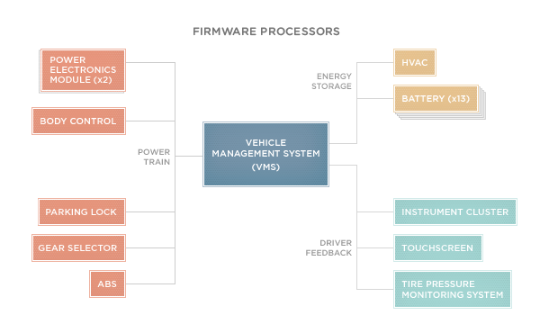

__Updated version: 04/07/2014__

## And there's more..

W3C business group published a very nice material about the Vehicle Information API and how could/can work.

Pretty exciting! To know more <a href="https://rawgit.com/w3c/automotive-bg/master/snapshots/vehicle_spec_snapshot20140425.html" target="_blank" title="W3C business group - Vehicle Information API">click here</a>.

__Updated version: 03/03/2014__

## As imagined..

Looks like isn't just me excited to see applications on cars.. Apple announced <a href="https://www.apple.com/ios/carplay/" target="_blank" title="CarPlay">CarPlay</a>.

You can read more on <a href="http://techcrunch.com/2014/03/03/apples-new-carplay-system-will-turn-tens-of-millions-of-cars-into-iphone-accessories/" target="_blank" title="Apple’s New CarPlay System Will Turn Tens Of Millions Of Cars Into iPhone Accessories">TechCrunch</a>.

__Original version: 02/26/2014__

## it's all about mobility

I have been very curious about developing any kind of software for cars.. but of course I would be much more interested in develop using Open Web Technologies perhaps HTML5/CSS3 and Javascript how AWESOME that would be?

Anyway. while trying to find any sort of material on something I can feed my mind about it I found some very interesting stuff and gathered all in one post.

So for those that don't know there's actually a W3C group to bring and to accelerate the adoption of Web technologies in the automotive industry.
The group will focus on defining a Vehicle Data API that will create new opportunities for automotive services via the Web.

__Some of the advantages of Web Applications__

Web technologies are well known and "well supported" by devices therefore would make the adoption "easier".
and since Web technologies are based on open standards, developers are not held hostage by particular vendors.

__Challenges to adopt Web Technology in the Car__

Driver distraction the biggest one.. but can be solved by HMI (Human-Machine Interface) standard guidelines on how the driver interact with the UI while certain behavior e.g car in movement.

Cost. Web Technologies has a very good connectivity stack Bluetooth, Wi-Fi, Cellular, TCP/IP Stack, Embedded Browser and to bring all this will increase software and hardware cost.

## Tesla and Vehicle Management System

Tesla and the Vehicle Management System..you ask me why?! First of all I am a Elon Musk "superfan" not just because of his incredible desire to change the world but also because I'm curious to know how they do to have such a incredible product/car.

To know more about it please read [A Silicon Valley approach to vehicle software](http://www.teslamotors.com/roadster/technology/firmware)

## Model S 17-Inch Touchscreen Display

As they say "the world's most advanced vehicle user interface" and I wont disagree.

<iframe src="//player.vimeo.com/video/61821553?title=0&amp;byline=0&amp;portrait=0" frameborder="0" allowfullscreen="allowfullscreen"> </iframe>

Imagine the possibilities through the UX/UI using Open Web technologies.. It wont just take us to point A to point B anymore.

__References__:
- [w3c and automotive](http://www.prnewswire.com/news-releases/genivi-alliance-teams-with-w3c-to-accelerate-adoption-of-web-technologies-in-the-automotive-industry-209315251.html)
- [http://www.w3.org/wiki/Web_and_Automotive](http://www.w3.org/wiki/Web_and_Automotive)
- [http://www.w3.org/2013/02/autobg.html.en](http://www.w3.org/2013/02/autobg.html.en)

Cheers!
