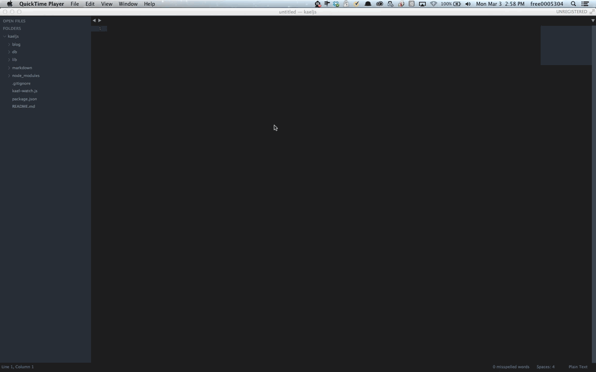

Quick blog post to show you how to easily add the feature goto or jump to definition on Sublime text 3 with custom shortcut



## Simple steps

In Sublime Text 3
```html
Sublime Text -> Preferences -> Key Bindings - User
```

You can add any shortcut you want since it's not in use already so you don't overwrite the default shortcut settings.

In my case I decided to use "shift+command+m"..as below.

```javascript
[
    { "keys": ["shift+command+m"], "command": "goto_definition" }
]
```

Save it and you are done. (ps: if did not work restart your Sublime Text 3).

Thanks.