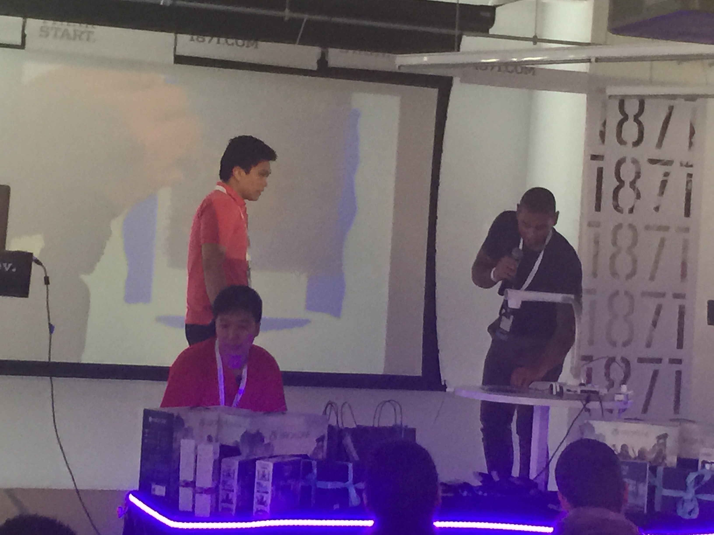

### Experimenting with IoT

So there was I at <a href="https://2015.battlehack.org/" title="Battlehack Chicago" target="_blank">Battlehack</a> Chicago brainstorming ideas...trying to come up with something I would have fun developing and at the same time learn something new.

After teaming up with <a href="https://josephmilla.com/" title="Joseph Milla" target="_blank">Joseph Milla</a> a young and smart CS student, After discussing what we should do we decided to build something related to IoT so we ended up using my <a href="https://tessel.io/" title="Tessel IoT" target="_blank">Tessel</a>micro-controller and the Tessel Ambient module.

Tessel is a micro-controller with built-in wifi and support to run nodejs out-of-the-box, therefore we were good because both of us have experience with Nodejs.

### Clappity

<a href="https://github.com/josephmilla/clappity" title="Clappity" target="_blank">Clappity</a> is a device that you plug into your wall and listen to your configured claps to trigger an online order, in our case you would be able to order a pizza, sandwich or burrito.

### How does it that work? 

Anyone could just clap and order without permission, right? no.  
The device would be linked to your user account in the website where you would have access to order options and how many claps they require through the user configuration.  
All claps have 1x clap for confirmation.. let's say you want to order pizza, you would clap 2x than wait 3 secs and clap again to confirm you actually want that.

The tech stack:

- Tessel micro-controller
- Tessel Ambient Module
- Node.js (websocket)
- HTML5/Javascript

We did not win the Battlehack but was a fun experimentation with IoT.  
The code is <a href="https://github.com/josephmilla/clappity" title="Clappity Open Source" target="_blank">Open Source</a>.